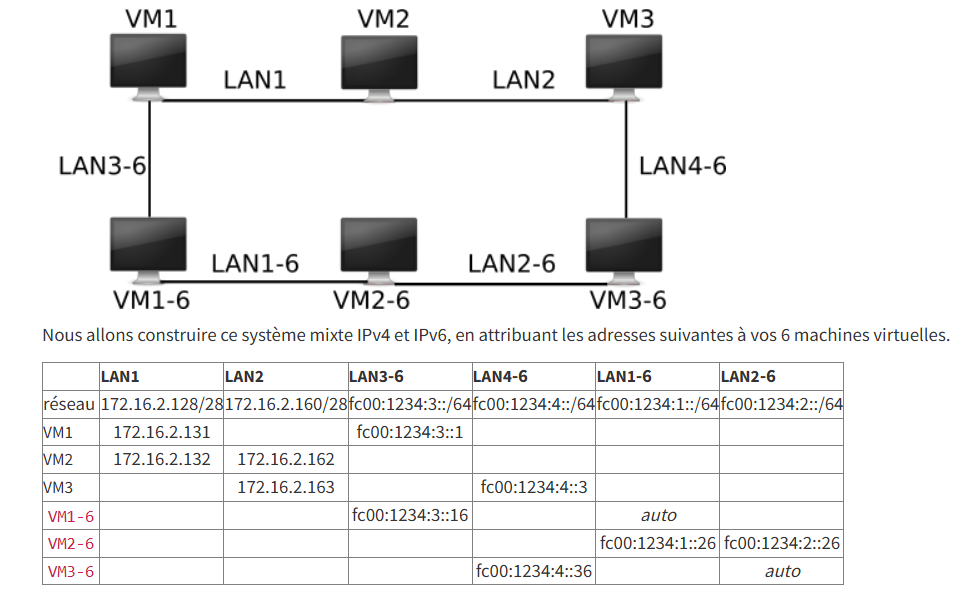

# Configuration d'un réseau de VMs

## Description
TP réalisé dans le cadre du master en **cybersécurité**.
L'objectif était de mettre en place une **infrastructure réseau** combinant des interfaces et des routes **IPv4** et **IPv6**, à l'aide de **6 machines virtuelles** (VM), et de l'outil **Vagrant**.

## Contenu
- 6 fichiers de configuration de Vagrant (`*.sls`).
- Chaque fichier permet de configurer manuellement une VM en adressant les interfaces et les routes.

## Schéma réseau

## Compétences mises en oeuvre
- **Virtualisation** avec VirtualBox + Vagrant.
- **Adressage** IPv4 et IPv6.
- **Routage**.
